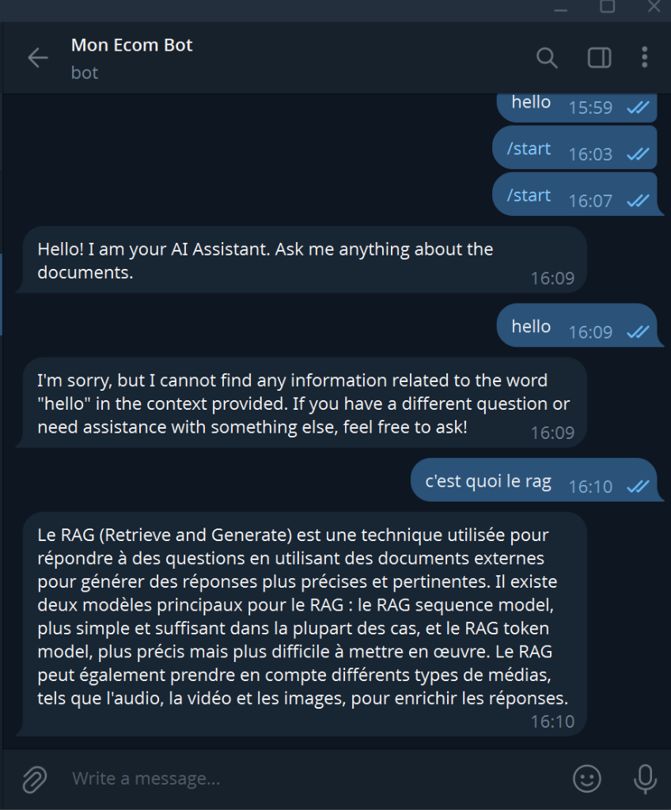

# RAG Chatbot Service

This microservice implements a **RAG (Retrieval Augmented Generation) Chatbot** using Spring AI and OpenAI, integrated with Telegram.

## Features
- **Retrieval Augmented Generation (RAG)**: Ingests PDF documents and uses them as context to answer user queries.
- **Telegram Integration**: Users can interact with the bot via a Telegram client.
- **Spring AI**: Leverages the Spring AI framework for vector store management and LLM interaction.

## Prerequisites
- Java 17
- OpenAI API Key
- Telegram Bot Token

## Configuration
Copy `src/main/resources/application.properties.example` to `src/main/resources/application.properties` and fill in your keys:

```properties
spring.ai.openai.api-key=YOUR_KEY
telegram.bot.token=YOUR_TOKEN
telegram.bot.username=yourbotname
```

## Running the Service
```bash
./mvnw spring-boot:run
```

## Demo
Here is the bot in action, answering questions based on the course material:


